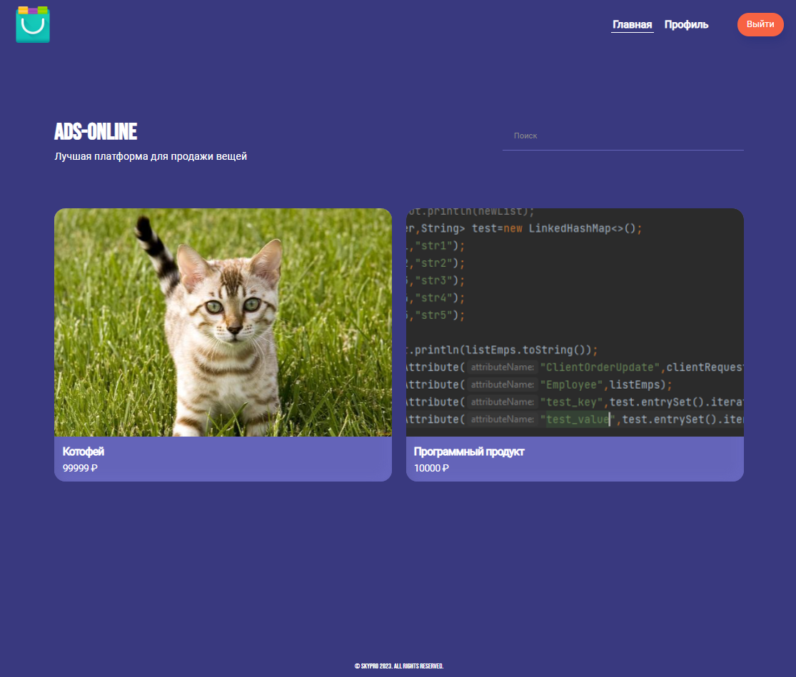
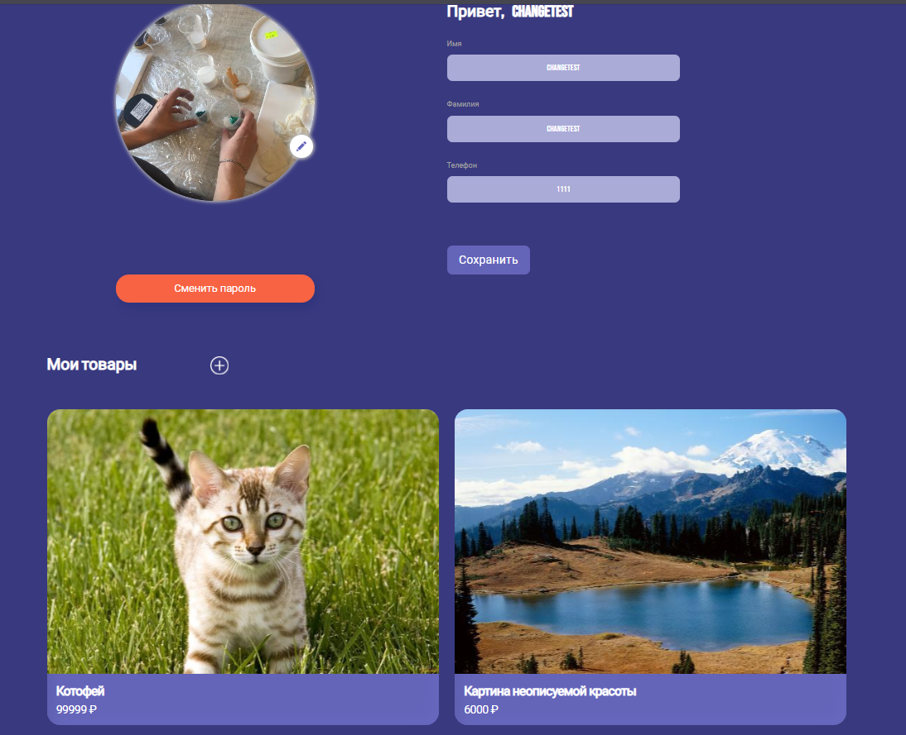
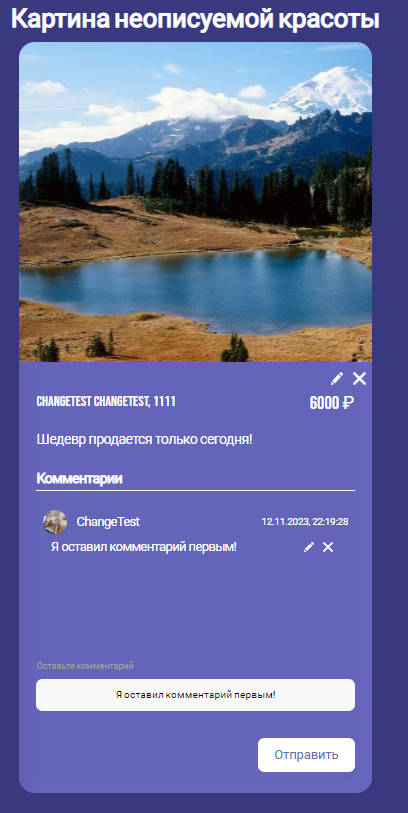
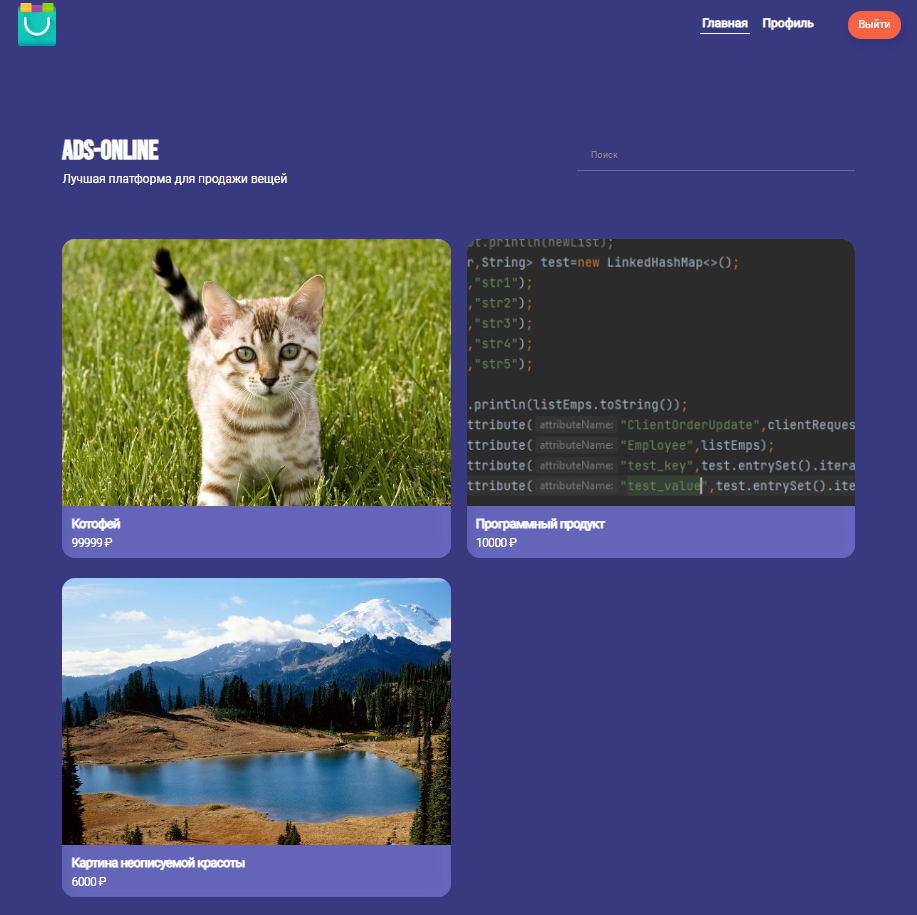
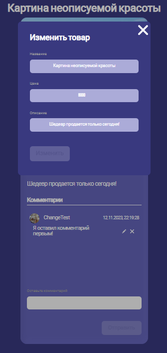

<h1 align="center">Backend сайта объявлений.</h1>

<div align="center">


</div>
<div align="center">



</div>

<center><h2>Распределение прав</h2></center>
<center>
<table style="width: 70%; border-color: red; margin-left: auto; margin-right: auto;">
<thead>
<tr style="height: 13px;">
<th style="height: 13px; width: 11.0296%;"><span style="color: #ffffff;">Роль</span></th>
<th style="height: 13px; width: 60.9704%;"><span style="color: #ffffff;">Полномочия</span></th>
</tr>
</thead>
<tbody>
<tr style="height: 13px;">
<td style="height: 13px; width: 11.0296%;"><span style="color: #ffffff;">Гость</span></td>
<td style="height: 13px; width: 60.9704%;">
<ul>
<li><span style="color: #ffffff;">&nbsp;Просмотривать весь список объявлений на сайте</span></li>
</ul>
</td>
</tr>
<tr style="height: 13.2812px;">
<td style="height: 13.2812px; width: 11.0296%;"><span style="color: #ffffff;">Админ</span></td>
<td style="height: 13.2812px; width: 60.9704%;">
<ul>
<li><span style="color: #ffffff;">&nbsp;Редактировать и удалять любые комментарии.</span></li>
<li><span style="color: #ffffff;">&nbsp;Редактировать и удалять любые объявления.</span></li>
</ul>
</td>
</tr>
<tr style="height: 13px;">
<td style="height: 13px; width: 11.0296%;"><span style="color: #ffffff;">&nbsp;Пользователь</span></td>
<td style="height: 13px; width: 60.9704%; border-color: white;">
<ul>
<li><span style="color: #ffffff;">Просматривать список всех объявлений.</span></li>
<li><span style="color: #ffffff;">Просматривать каждое объявление.</span></li>
<li><span style="color: #ffffff;">Создавать объявление.</span></li>
<li><span style="color: #ffffff;">Редактировать и удалять свое объявление.</span></li>
<li><span style="color: #ffffff;">Просматривать все комментарии к объявлениям.</span></li>
<li><span style="color: #ffffff;">Создавать комментарии к любым объявлениям.</span></li>
<li><span style="color: #ffffff;">Редактировать/удалять свои комментарии.</span></li>
</ul>
</td>
</tr>
</tbody>
</table>
</center>

**Особенности проекта**
Файлы, загружаемые с клиента, сохраняются на жесткий диск
Директорию можно изменить  
<pre>
| файл:     | application.properties  
| параметр: | path.avito.image.folder=c:/avito/images/
</pre>  
Если размер картинки более 500кб, то будет она будет резаться библиотекой imgScalar
 600 пикселей по ширине, высота пропорционально.

**Для запуска нужно:**

1. Клонировать проект и настроить значения в файле [application.properties](src/main/resources/application.properties)
2. Скачать **[Docker](https://www.docker.com)** и запустить его.
3. Скачать и запустить Docker образ с помощью
   команды ```docker run -p 3000:3000 ghcr.io/bizinmitya/front-react-avito:latest```.
4. Запустить метод **main** программы.
5. После этого будет доступен функционал сайта  http://localhost:3000 и Swagger
   UI   http://localhost:8080/swagger-ui/index.html#.

<h3>Участники проекта:</h3>
<ul>
<li> Евгений Белых</li>
<li> Лапутин Александр</li>
</ul>